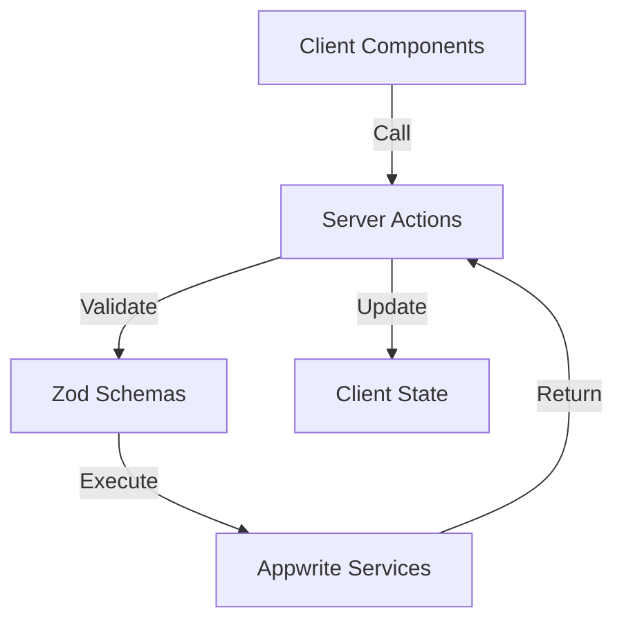
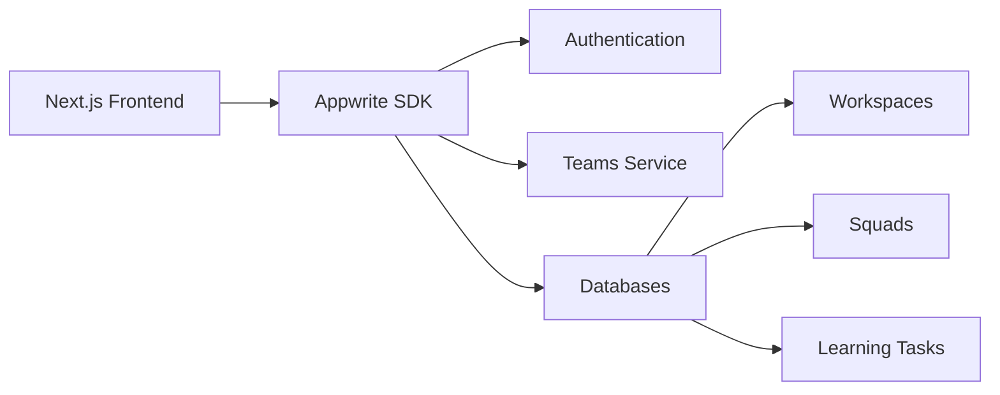

# Memlernado

[](https://nextjs.org)
[](https://appwrite.io)

A collaborative learning platform bringing agile methodologies to homeschool teams. Designed to help children self-organize and manage their learning journey using SCRUM-inspired workflows.

## 🎯 Project Overview

Memlernado transforms homeschooling by:
- Providing Jira-like task management for young learners
- Enabling collaborative planning between families
- Teaching project management fundamentals through practice
- Offering kid-friendly interfaces for educational workflows

**Target Audience**: Homeschool collectives & families managing group learning

## ✨ Features

- **Workspace Management**
  - Create collaborative learning spaces
  - Manage team members and permissions
- **Learning Sprints**
  - Backlog creation and task prioritization
  - Visual Kanban-style task boards
  - Progress tracking and reporting
- **Access Control**
  - Parent/Teacher vs Student roles
  - Secure invitation system
- **Analytics**
  - Learning progress visualization
  - Team performance metrics

## 🛠 Tech Stack

- **Frontend**: 
  - Next.js 14 (App Router)
  - React 18
  - Shadcn/ui + Tailwind CSS
- **Backend**: 
  - Appwrite (Auth, Databases, Teams)
- **Validation**: 
  - Zod
- **Utilities**: 
  - Day.js (Date handling)
  - Lucide React (Icons)
  - Tailwind Merge + clsx (ClassName management)

## 🚀 Getting Started

### Environment Setup

1. Create `.env.local` file:
```bash
NEXT_PUBLIC_APPWRITE_ENDPOINT=your_appwrite_endpoint
NEXT_PUBLIC_APPWRITE_PROJECT_ID=your_project_id
NEXT_APPWRITE_KEY=your_secret_key
```

2. Install dependencies:
```bash
yarn
```

3. Run development server:
```bash
yarn dev
```

## 📁 Project Structure

This is a [Next.js](https://nextjs.org) project bootstrapped with [`create-next-app`](https://nextjs.org/docs/app/api-reference/cli/create-next-app).

## Getting Started

First, run the development server:

```bash
yarn dev
```

Open [http://localhost:3000](http://localhost:3000) with your browser to see the result.

You can start editing the page by modifying `app/page.tsx`. The page auto-updates as you edit the file.

For the moment, this project uses [`next/font`](https://nextjs.org/docs/app/building-your-application/optimizing/fonts) to automatically optimize and load [Geist](https://vercel.com/font), a new font family for Vercel.

## 🏗 Architecture Overview

### Core Patterns
- **SSR-First Approach**: Maximum server-side rendering with selective client interactivity
- **Role-Based Access**: Dual permission system (UI + Server Actions)
- **Real-Time Updates**: Appwrite WebSocket integration for collaborative features
- **Type Safety**: Strict TypeScript enforcement with shared types (`lib/types.ts`)

### Data Flow


### Key Directories
```bash
memlernado/
├── app/                 # App Router entries
│   ├── (auth)          # Authentication routes
│   ├── workspace/      # Main application (requires auth)
│   │   ├── settings/   # Team configuration
│   │   └── squad/     # Learning group management
│   └── onboarding/     # New user setup flows
│
├── actions/             # Server Actions
│   ├── auth/           # Auth operations
│   ├── workspace/      # Team management
│   └── squad/          # Learning group operations
│
├── components/          # UI Components
│   ├── ui/             # Shadcn/ui primitives
│   ├── sidebar.tsx     # Navigation structure
│   └── squad-selector/ # Team switching logic
│
├── lib/
│   ├── server/         # Appwrite server services
│   │   └── services/  # Database operations
│   └── client/         # Frontend Appwrite config
│
└── types/              # Shared TS types
```

### Notable Implementation Details

1. **Authentication Flow**
   - Appwrite session cookies for SSR
   - OAuth2 integration with Google
   - Invite system via workspace tokens

2. **State Management**
   - Server-side data fetching in page components
   - Client state via React hooks (`useState/useContext`)
   - Optimistic updates using Appwrite real-time

3. **Component Architecture**
   - Presentational components in `components/ui`
   - Smart containers in page layouts
   - Custom hooks for business logic (`hooks/`)

4. **Validation Layers**
   - Zod schemas for all form submissions
   - Server action input validation
   - Role checks in service layer

### Development Conventions
- **New Feature Setup**:
  1. Create route group in `app/`
  2. Add server actions in `actions/`
  3. Create components in `components/`
  4. Add type definitions in `types/`

- **Testing Practices (TODO)**:
  - Storybook stories for UI components
  - End-to-end tests for critical user flows
  - Mock Appwrite APIs in development

### Appwrite Integration


